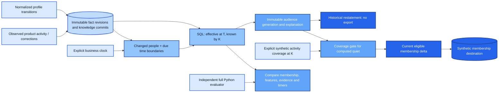

# Temporal Customer Audiences

**Who belongs in an audience now—and how can late information correct yesterday without rewriting what we knew then?**

This project maintains customer audiences across **business time** and **knowledge time**. It preserves original decisions, produces separate historical restatements, expires membership when no new data arrives, and emits only the changes needed by a synthetic destination.

**Start with the [executed proof](docs/evidence/report.md).** One fictional trial customer makes the distinction visible:

| Question | Business time | Knowledge available | Result |
|---|---|---|---|
| What did we originally know? | Day 3 | One observed qualifying event | Not engaged |
| What does a late event change? | Same day 3 | Two qualifying events now known | Historical engagement changes; original decision remains intact |
| What happens with no new input? | Day 5 | Same knowledge | Quiet-trial membership begins as recent activity ages out |
| What happens later? | Day 8 | Same knowledge | Engaged-trial membership expires |

“Engaged” uses a seven-day window; “quiet” uses three days with no **observed** qualifying activity. The audiences can overlap. Neither is permission to contact a customer, and quiet does not prove no real-world activity occurred.

**Computed quiet is separate from export eligibility.** Without an explicit coverage assertion for the entire three-day observation window through T, quiet members are suppressed from the synthetic destination. At the first second beyond coverage, export eligibility expires even with no new customer facts. Engagement remains eligible on positive evidence. The [executed coverage counterexample](docs/evidence/report.md#executed-coverage-counterexample) shows this distinction without claiming real-source completeness.

## The new engineering proof

The existing portfolio covers analytics, governed state, agent evaluation and migration. This repository adds **retraction-aware audience history at two time coordinates, plus incremental query maintenance driven by both arrivals and time boundaries**. It does not rebuild identity resolution, consent policy, approvals or workflow execution. The [four-candidate decision](docs/decision.md) explains why this narrow fifth project clears the overlap test.



## What is demonstrated

- **Two-time correctness:** a late arrival changes a restated historical answer while the original knowledge-bounded answer stays reproducible.
- **Expiry without ingestion:** publishing at a later supplied clock processes due activity windows and future profile transitions.
- **Revision semantics:** retractions, late lower revisions and corrections that move effective time do not accidentally revive superseded facts.
- **Coverage-conditioned export:** missing, incomplete, expired or retracted coverage suppresses quiet activation; late coverage can restate historical eligibility without rewriting old generations. Clock-only expiry removes destination membership while reusing customer features.
- **Selective maintenance:** an executed one-person correction reevaluates **1 of 120 people**, with the same result as independent full evaluation. Full generation assembly still copies all people; this is not an end-to-end complexity or throughput claim.
- **Inspectable decisions:** additions/removals carry reasons; every generation retains source fact revisions, counts, evaluation coordinates and due boundaries. Coverage evidence and its evaluation coordinates are retained separately from reused customer decisions. A general before/after causal explanation is not implemented.
- **Historical/current separation:** a backfill cannot move the active pointer or produce an export bundle.
- **Destination correctness:** ordered deltas reconstruct the audience; old delivery cannot resurrect removed membership, and injected destination drift is detected.

## Reproduce

Use Python **3.12** from the extracted repository root:

```bash
python -m venv .venv
# Activate .venv for your shell.
python -m pip install -r requirements.lock
python -m pip install --no-deps --no-build-isolation -e .
python scripts/verify.py
```

The runtime uses Python and SQLite, with no third-party runtime dependencies. Locked packages support testing and packaging. No cloud credentials, paid provider or Docker engine are required.

Verification runs lint, dependency checks, temporal/boundary/negative tests, randomized incremental-versus-full checks and the complete asserted demonstration. It regenerates [test results](docs/evidence/tests.xml), [source-hashed validation](docs/evidence/verification.json), [detailed proof](docs/evidence/temporal-proof.json) and a [timeline CSV](docs/evidence/timeline.csv). To run only the story: `python scripts/demo.py`.

## Boundaries

All records and external behavior are synthetic. Person identity and normalized profile authority are assumed inputs. There are no campaign sends, real customer records, vendor connectors, AI agents or claimed Salesforce/Data Cloud/Snowflake deployments.

The executed build is local Windows/Python/SQLite. Windows and Ubuntu CI are provided; **hosted CI has not been observed for this new repository**. Successful CI observed for the four earlier repositories does not imply this one has run remotely.

The rules are deliberately finite and person-local, with one source-wide coverage gate. The engine has an explicit clock and persisted due boundaries, not an always-on scheduler. Coverage is supplied synthetic evidence; the engine cannot establish whether a real source delivered everything. It does not establish privacy-erasure compliance, distributed scale or production readiness. [Architecture](docs/architecture.md), [operations](docs/operations.md) and [validation/limits](docs/validation.md) make those assumptions inspectable.

[Finished handoff](docs/handoff.md) · [Why this fifth project](docs/decision.md)
